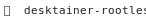
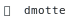

# dmotte

**Quick access** to the list of all my projects.

### Docker

<a href="https://github.com/dmotte/desktainer"><picture><source media="(prefers-color-scheme: dark)" srcset="badges/dark-desktainer.svg"><source media="(prefers-color-scheme: light)" srcset="badges/light-desktainer.svg"></picture></a>&nbsp;<a href="https://github.com/dmotte/desktainer-rootless"><picture><source media="(prefers-color-scheme: dark)" srcset="badges/dark-desktainer-rootless.svg"><source media="(prefers-color-scheme: light)" srcset="badges/light-desktainer-rootless.svg"></picture></a>&nbsp;<a href="https://github.com/dmotte/docker-portfwd-server"><picture><source media="(prefers-color-scheme: dark)" srcset="badges/dark-docker-portfwd-server.svg"><source media="(prefers-color-scheme: light)" srcset="badges/light-docker-portfwd-server.svg"></picture></a>&nbsp;<a href="https://github.com/dmotte/docker-portfwd-server-rootless"><picture><source media="(prefers-color-scheme: dark)" srcset="badges/dark-docker-portfwd-server-rootless.svg"><source media="(prefers-color-scheme: light)" srcset="badges/light-docker-portfwd-server-rootless.svg"></picture></a>&nbsp;<a href="https://github.com/dmotte/docker-portmap-client"><picture><source media="(prefers-color-scheme: dark)" srcset="badges/dark-docker-portmap-client.svg"><source media="(prefers-color-scheme: light)" srcset="badges/light-docker-portmap-client.svg"></picture></a>&nbsp;<a href="https://github.com/dmotte/docker-portmap-server"><picture><source media="(prefers-color-scheme: dark)" srcset="badges/dark-docker-portmap-server.svg"><source media="(prefers-color-scheme: light)" srcset="badges/light-docker-portmap-server.svg"></picture></a>&nbsp;<a href="https://github.com/dmotte/docker-portmap-server-rootless"><picture><source media="(prefers-color-scheme: dark)" srcset="badges/dark-docker-portmap-server-rootless.svg"><source media="(prefers-color-scheme: light)" srcset="badges/light-docker-portmap-server-rootless.svg"></picture></a>&nbsp;<a href="https://github.com/dmotte/docker-xfwd"><picture><source media="(prefers-color-scheme: dark)" srcset="badges/dark-docker-xfwd.svg"><source media="(prefers-color-scheme: light)" srcset="badges/light-docker-xfwd.svg"></picture></a>&nbsp;<a href="https://github.com/dmotte/svcbox"><picture><source media="(prefers-color-scheme: dark)" srcset="badges/dark-svcbox.svg"><source media="(prefers-color-scheme: light)" srcset="badges/light-svcbox.svg"></picture></a>&nbsp;<a href="https://github.com/dmotte/svcbox-rootless"><picture><source media="(prefers-color-scheme: dark)" srcset="badges/dark-svcbox-rootless.svg"><source media="(prefers-color-scheme: light)" srcset="badges/light-svcbox-rootless.svg"></picture></a>&nbsp;<a href="https://github.com/dmotte/webauthn-proxy"><picture><source media="(prefers-color-scheme: dark)" srcset="badges/dark-webauthn-proxy.svg"><source media="(prefers-color-scheme: light)" srcset="badges/light-webauthn-proxy.svg"></picture></a>&nbsp;

### Python

<a href="https://github.com/dmotte/apycalc"><picture><source media="(prefers-color-scheme: dark)" srcset="badges/dark-apycalc.svg"><source media="(prefers-color-scheme: light)" srcset="badges/light-apycalc.svg"></picture></a>&nbsp;<a href="https://github.com/dmotte/cashlog"><picture><source media="(prefers-color-scheme: dark)" srcset="badges/dark-cashlog.svg"><source media="(prefers-color-scheme: light)" srcset="badges/light-cashlog.svg"></picture></a>&nbsp;<a href="https://github.com/dmotte/investats"><picture><source media="(prefers-color-scheme: dark)" srcset="badges/dark-investats.svg"><source media="(prefers-color-scheme: light)" srcset="badges/light-investats.svg"></picture></a>&nbsp;<a href="https://github.com/dmotte/jctlfmt"><picture><source media="(prefers-color-scheme: dark)" srcset="badges/dark-jctlfmt.svg"><source media="(prefers-color-scheme: light)" srcset="badges/light-jctlfmt.svg"></picture></a>&nbsp;<a href="https://github.com/dmotte/smartchg"><picture><source media="(prefers-color-scheme: dark)" srcset="badges/dark-smartchg.svg"><source media="(prefers-color-scheme: light)" srcset="badges/light-smartchg.svg"></picture></a>&nbsp;<a href="https://github.com/dmotte/ui24rsc"><picture><source media="(prefers-color-scheme: dark)" srcset="badges/dark-ui24rsc.svg"><source media="(prefers-color-scheme: light)" srcset="badges/light-ui24rsc.svg"></picture></a>&nbsp;

### Rust

<a href="https://github.com/dmotte/msgbuf"><picture><source media="(prefers-color-scheme: dark)" srcset="badges/dark-msgbuf.svg"><source media="(prefers-color-scheme: light)" srcset="badges/light-msgbuf.svg"></picture></a>&nbsp;

### Vagrant

<a href="https://github.com/dmotte/vagrant-ansiblebox"><picture><source media="(prefers-color-scheme: dark)" srcset="badges/dark-vagrant-ansiblebox.svg"><source media="(prefers-color-scheme: light)" srcset="badges/light-vagrant-ansiblebox.svg"></picture></a>&nbsp;<a href="https://github.com/dmotte/vagrant-dockerbox"><picture><source media="(prefers-color-scheme: dark)" srcset="badges/dark-vagrant-dockerbox.svg"><source media="(prefers-color-scheme: light)" srcset="badges/light-vagrant-dockerbox.svg"></picture></a>&nbsp;<a href="https://github.com/dmotte/vagrant-k3sbox"><picture><source media="(prefers-color-scheme: dark)" srcset="badges/dark-vagrant-k3sbox.svg"><source media="(prefers-color-scheme: light)" srcset="badges/light-vagrant-k3sbox.svg"></picture></a>&nbsp;<a href="https://github.com/dmotte/vagrant-podmanbox"><picture><source media="(prefers-color-scheme: dark)" srcset="badges/dark-vagrant-podmanbox.svg"><source media="(prefers-color-scheme: light)" srcset="badges/light-vagrant-podmanbox.svg"></picture></a>&nbsp;<a href="https://github.com/dmotte/vagrant-vagrantbox"><picture><source media="(prefers-color-scheme: dark)" srcset="badges/dark-vagrant-vagrantbox.svg"><source media="(prefers-color-scheme: light)" srcset="badges/light-vagrant-vagrantbox.svg"></picture></a>&nbsp;

### Others

<a href="https://github.com/dmotte/bnplay"><picture><source media="(prefers-color-scheme: dark)" srcset="badges/dark-bnplay.svg"><source media="(prefers-color-scheme: light)" srcset="badges/light-bnplay.svg"></picture></a>&nbsp;<a href="https://github.com/dmotte/cronjobs"><picture><source media="(prefers-color-scheme: dark)" srcset="badges/dark-cronjobs.svg"><source media="(prefers-color-scheme: light)" srcset="badges/light-cronjobs.svg"></picture></a>&nbsp;<a href="https://github.com/dmotte/dmotte"><picture><source media="(prefers-color-scheme: dark)" srcset="badges/dark-dmotte.svg"><source media="(prefers-color-scheme: light)" srcset="badges/light-dmotte.svg"></picture></a>&nbsp;<a href="https://github.com/dmotte/dmotte.github.io"><picture><source media="(prefers-color-scheme: dark)" srcset="badges/dark-dmotte.github.io.svg"><source media="(prefers-color-scheme: light)" srcset="badges/light-dmotte.github.io.svg"></picture></a>&nbsp;<a href="https://github.com/dmotte/docker-images"><picture><source media="(prefers-color-scheme: dark)" srcset="badges/dark-docker-images.svg"><source media="(prefers-color-scheme: light)" srcset="badges/light-docker-images.svg"></picture></a>&nbsp;<a href="https://github.com/dmotte/livepasv"><picture><source media="(prefers-color-scheme: dark)" srcset="badges/dark-livepasv.svg"><source media="(prefers-color-scheme: light)" srcset="badges/light-livepasv.svg"></picture></a>&nbsp;<a href="https://github.com/dmotte/misc"><picture><source media="(prefers-color-scheme: dark)" srcset="badges/dark-misc.svg"><source media="(prefers-color-scheme: light)" srcset="badges/light-misc.svg"></picture></a>&nbsp;<a href="https://github.com/dmotte/webmedia"><picture><source media="(prefers-color-scheme: dark)" srcset="badges/dark-webmedia.svg"><source media="(prefers-color-scheme: light)" srcset="badges/light-webmedia.svg"></picture></a>&nbsp;<a href="https://github.com/dmotte/winautoclicker"><picture><source media="(prefers-color-scheme: dark)" srcset="badges/dark-winautoclicker.svg"><source media="(prefers-color-scheme: light)" srcset="badges/light-winautoclicker.svg"></picture></a>&nbsp;

> **Note**: this content was **automatically generated** by a [**custom script**](https://github.com/dmotte/dmotte/blob/main/cicd.sh).
