# dmotte

**Quick access** to the list of all my projects.

### Docker

[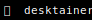](https://github.com/dmotte/desktainer)&nbsp;&nbsp;[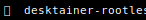](https://github.com/dmotte/desktainer-rootless)&nbsp;&nbsp;[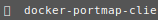](https://github.com/dmotte/docker-portmap-client)&nbsp;&nbsp;[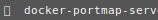](https://github.com/dmotte/docker-portmap-server)&nbsp;&nbsp;[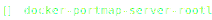](https://github.com/dmotte/docker-portmap-server-rootless)&nbsp;&nbsp;&nbsp;&nbsp;[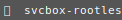](https://github.com/dmotte/svcbox-rootless)&nbsp;&nbsp;[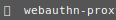](https://github.com/dmotte/webauthn-proxy)

### Python

[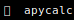](https://github.com/dmotte/apycalc)&nbsp;&nbsp;[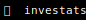](https://github.com/dmotte/investats)&nbsp;&nbsp;[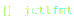](https://github.com/dmotte/jctlfmt)&nbsp;&nbsp;[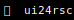](https://github.com/dmotte/ui24rsc)

### Rust

[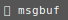](https://github.com/dmotte/msgbuf)

### Vagrant

&nbsp;&nbsp;[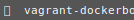](https://github.com/dmotte/vagrant-dockerbox)&nbsp;&nbsp;&nbsp;&nbsp;[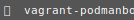](https://github.com/dmotte/vagrant-podmanbox)&nbsp;&nbsp;

### Others

[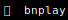](https://github.com/dmotte/bnplay)&nbsp;&nbsp;&nbsp;&nbsp;[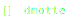](https://github.com/dmotte/dmotte)&nbsp;&nbsp;[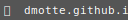](https://github.com/dmotte/dmotte.github.io)&nbsp;&nbsp;[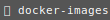](https://github.com/dmotte/docker-images)&nbsp;&nbsp;[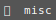](https://github.com/dmotte/misc)&nbsp;&nbsp;[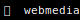](https://github.com/dmotte/webmedia)&nbsp;&nbsp;[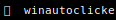](https://github.com/dmotte/winautoclicker)
